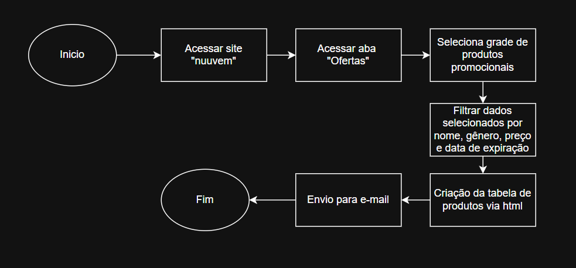

# nuuvem_automation 

Uma automação em Python para extração de **Preços Promocionais de jogos**, no site Nuuvem e envio automático via Gmail. O projeto foi desenvolvido com foco em **Modularidade**, **Automação de Processos** e **Boas Práticas**.

---
### 📐 Fluxograma do Processo



### ⚙️ Pré-requisitos

Ter o Python instalado na sua máquina:

```bash
# 🐧 Linux (Debian/Ubuntu)
sudo apt install python3 python3-pip

# 🍎 macOS (via Homebrew)
brew install python

# 🪟 Windows
winget install Python.Python.3
```

Instalar o Playwright e suas dependências:
```bash
pip install playwright
playwright install
```

---

### 🔧 Instalação

**1. Clonar o repositório**
```bash
git clone https://github.com/DouglasCruzz10/nuuvem_automation.git
```

**2. Criação de Ambiente Virtual**
```bash
Python -m Venv venv
\venv\Scripts\activate
```

**3. Instalação de Requisitos**
```bash
Python -r requirements.txt
```
**4. Criação das Variáveis de Ambiente**
```bash
1. Criar arquivo "credentials.env"
2. Inserir as informações a seguir:
EMAIL = "insira seu e-mail"
SENHA = "insira a senha"
DESTINATARIO = "insira o e-mail do destinatario que deseja enviar o e-mail"
```
**5. Executar o sistema**
```bash
Python main.py
```
---

### 🐳 Execução via Docker

**1. Construir a Imagem Docker**
```bash
docker build -t nuuvem-automation .
```

**2. Executar o Container**
```bash
docker run --rm --env-file credentials.env nuuvem-automation
```
### 🎯 Resultado Esperado
Ao finalizar a execução da automação, você deve esperar o seguinte fluxo de saída:

    Logs no Terminal: Confirmação da navegação no site da Nuuvem, extração da lista de jogos promocionais com seus respectivos preços e status final do envio do e-mail.

    E-mail Recebido: A caixa de entrada informada na variável DESTINATARIO receberá uma mensagem formatada contendo a compilação das ofertas coletadas.
Tabela Esperada:


## 🛠️ Construído com

* [](https://www.python.org/) — Linguagem principal do desenvolvimento
* [](https://playwright.dev/python/) — Automação de navegação 
* [](https://www.docker.com/) — Containerização e execução isolada

---

## ✒️ Autor

| Nome | Papel | GitHub |
|------|-------|--------|
| **Douglas  Cruz** | Desenvolvedor| [@DouglasCruzz10](https://github.com/DouglasCruzz10) |
